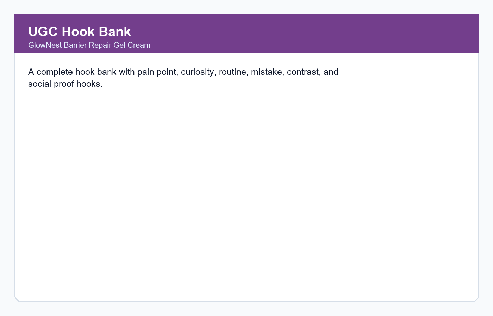
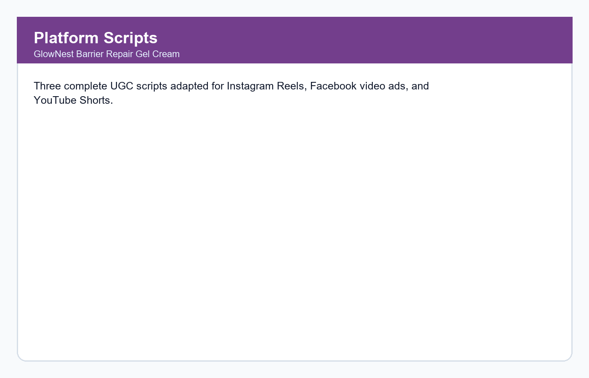
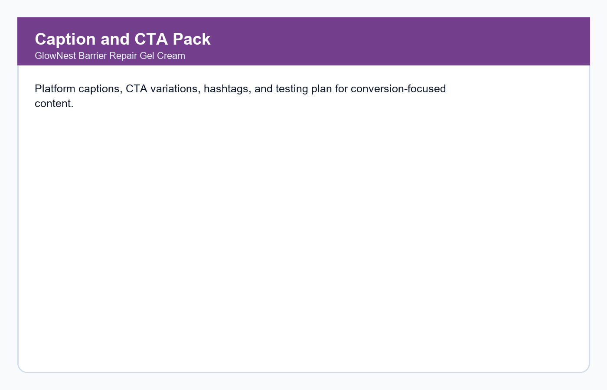

# Task 2 - AI Content Marketing Using UGC Ads
## GlowNest Barrier Repair Gel Cream | Future Interns - Prompt Engineering Track


## Intern Details

| Field | Details |
|---|---|
| Track | Prompt Engineering (PE) |
| Repository | FUTURE_PE_02 |
| Task | AI Content Marketing using UGC Ads |
| Product | GlowNest Barrier Repair Gel Cream |
| CIN ID | FIT/MAY26/PE2660 |
| Tools Used | Claude AI (claude.ai), Markdown, DOCX, GitHub |

## Project Overview

This project contains a complete AI-generated UGC Ad Content Pack for a realistic D2C skincare product. The content pack includes hooks, scripts, captions, CTAs, visual directions, platform adaptations, testing ideas, prompt screenshots, output screenshots, TXT files, and a DOCX report.

## Live Website / Demo Link

[Open the live project demo](https://anagha-t-r.github.io/FUTURE_PE_02/)

## Product Details

| Field | Details |
|---|---|
| Brand | GlowNest |
| Product | Barrier Repair Gel Cream |
| Category | D2C skincare |
| Audience | Students and working professionals aged 18-30 |
| Core Promise | Lightweight daily hydration for dry or sensitive-feeling skin |
| Tone | Warm, honest, practical, friendly |

## Prompt Engineering Approach

1. Business and audience framing
2. Brand voice and tone definition
3. Hook generation for short-form ads
4. Platform-specific UGC script generation
5. Caption, CTA, hashtag, and testing-plan refinement
6. Final documentation with screenshots and outputs

## Prompt Index

| # | File | Screenshot | Output Screenshot | Purpose |
|---|---|---|---|---|
| 1 | `txt/prompt_output_01.txt` | `screenshots/prompts/prompt_01.png` | `screenshots/outputs/output_01.png` | Business context |
| 2 | `txt/prompt_output_02.txt` | `screenshots/prompts/prompt_02.png` | `screenshots/outputs/output_02.png` | Brand voice |
| 3 | `txt/prompt_output_03.txt` | `screenshots/prompts/prompt_03.png` | `screenshots/outputs/output_03.png` | Hook generation |
| 4 | `txt/prompt_output_04.txt` | `screenshots/prompts/prompt_04.png` | `screenshots/outputs/output_04.png` | Instagram script |
| 5 | `txt/prompt_output_05.txt` | `screenshots/prompts/prompt_05.png` | `screenshots/outputs/output_05.png` | Facebook ad script |
| 6 | `txt/prompt_output_06.txt` | `screenshots/prompts/prompt_06.png` | `screenshots/outputs/output_06.png` | YouTube Shorts script |
| 7 | `txt/prompt_output_07.txt` | `screenshots/prompts/prompt_07.png` | `screenshots/outputs/output_07.png` | Captions and CTAs |
| 8 | `txt/prompt_output_08.txt` | `screenshots/prompts/prompt_08.png` | `screenshots/outputs/output_08.png` | Visual direction |
| 9 | `txt/prompt_output_09.txt` | `screenshots/prompts/prompt_09.png` | `screenshots/outputs/output_09.png` | CTA testing |
| 10 | `txt/prompt_output_10.txt` | `screenshots/prompts/prompt_10.png` | `screenshots/outputs/output_10.png` | Content testing plan |

## Repository Structure

```text
FUTURE_PE_02/
├── README.md
├── demo/
│   └── index.html
├── .github/
│   └── workflows/
│       └── pages.yml
├── documents/
│   └── FUTURE_PE_02_submission_report.docx
├── outputs/
│   └── ugc_ad_content_pack.md
├── prompts/
│   ├── 01_prompt_strategy.md
│   └── 02_reusable_prompt_templates.md
├── screenshots/
│   ├── final_product/
│   ├── outputs/
│   └── prompts/
└── txt/
    ├── final_product_summary.txt
    └── prompt_output_01.txt ... prompt_output_10.txt
```

## Final Product Screenshots





## Deliverables

- 10 prompt screenshots
- 10 respective output screenshots
- TXT prompt-output files
- Final UGC ad content pack
- DOCX submission report
- README file
- Live GitHub Pages demo link

## Submission Checklist

- [x] Repository named `FUTURE_PE_02`
- [x] README file added
- [x] Prompt files added
- [x] Output files added
- [x] Prompt screenshots added
- [x] Respective output screenshots added
- [x] DOCX report added
- [x] Live demo link added

This project was created as part of the Future Interns Prompt Engineering Internship Program. Product details are fictional and created for learning purposes.
